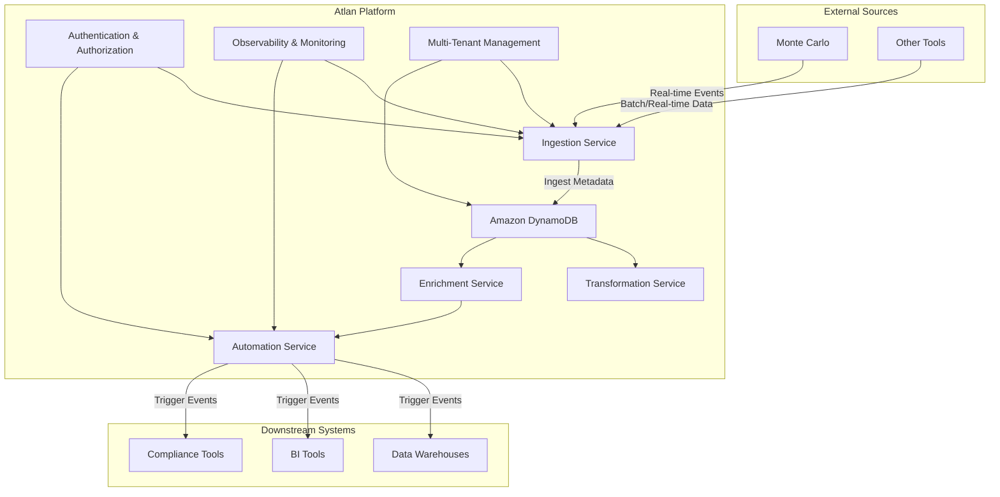

---

# Atlan Metadata Management System

## Overview

This system is designed to handle the ingestion, transformation, enrichment, and distribution of metadata in a near-real-time manner. It supports multiple use cases, including data observability, automated metadata enrichment, and compliance enforcement. The system is built using an event-driven architecture and utilizes Amazon DynamoDB as the metadata store for its scalability, performance, and seamless integration with other AWS services.

## Key Features

- **Real-Time Ingestion:** Capture and store metadata from external tools like Monte Carlo in real-time.
- **Scalable Metadata Store:** Efficiently manage billions of metadata assets with Amazon DynamoDB, ensuring low-latency access.
- **Automation Pipeline:** Automatically trigger downstream actions based on metadata changes.
- **Security:** Robust authentication and authorization using OAuth2 and JWT, with built-in security checks.
- **Multi-Tenant Support:** Flexible deployment options for both multi-tenant and isolated setups using docker and kubernetes.
- **Observability:** Integrated monitoring and logging for complete visibility of the platform.

## System Architecture

The architecture is built on an event-driven model using Apache Kafka, with microservices handling specific tasks. The metadata is stored in Amazon DynamoDB, and security is a first-class citizen throughout the system.

### Components

- **Ingestion Service:** Handles the real-time ingestion of metadata from external and internal sources.
- **Metadata Store:** Amazon DynamoDB is used for storing and retrieving metadata efficiently.
- **Transformation & Enrichment Services:** Process metadata to add context and ensure consistency.
- **Automation Service:** Listens for changes and triggers actions in downstream systems.
- **Authentication & Authorization:** Manages secure access to the platform with OAuth2 and JWT.
- **Observability:** Monitors and logs the system’s performance and health using tools like CloudWatch.

### System Design Diagram



### Cost Deployment Estimation

**1. Infrastructure Costs (AWS as an example):**

- **Kafka (MSK):** Approx. $454 per month for a 3-broker setup.
- **EC2 Instances:** Approx. $267.84 per month for 3 instances.
- **Amazon DynamoDB:**
  - Write Capacity: $1.25 per WCU-month for 1000 WCUs.
  - Read Capacity: $0.25 per RCU-month for 1000 RCUs.
  - Assuming 5000 WCUs and 5000 RCUs, monthly cost: ~$7.5 (write) + ~$1.25 (read) = $8.75 per GB.
  
- **S3 Storage (For Backups):** Approx. $2.30 per month for 100GB.
- **CloudWatch Monitoring:** Approx. $10 per month.

**2. Total Estimated Monthly Cost:** $742.89


### Python Prototype

The prototype includes three main components:

1. **Ingestion Service (FastAPI):** Ingests metadata from external sources and sends it to Kafka, with a mock security check.
2. **Transformation & Enrichment Service:** Listens to Kafka for incoming metadata, applies transformations, and enriches the data.
3. **Automation Service:** Triggers downstream actions based on enriched metadata.

#### 1. **Ingestion Service (FastAPI)**

```python
from fastapi import FastAPI, HTTPException, Depends
from kafka import KafkaProducer
import json
from pydantic import BaseModel
from typing import Dict
import jwt

app = FastAPI()

# Mock security check
SECRET_KEY = "mysecretkey"

def security_check(token: str):
    try:
        payload = jwt.decode(token, SECRET_KEY, algorithms=["HS256"])
        return payload
    except jwt.ExpiredSignatureError:
        raise HTTPException(status_code=401, detail="Token expired")
    except jwt.InvalidTokenError:
        raise HTTPException(status_code=401, detail="Invalid token")

class Metadata(BaseModel):
    entity_id: str
    data: Dict[str, str]

# Kafka Producer to send messages to the metadata store
producer = KafkaProducer(bootstrap_servers='localhost:9092', value_serializer=lambda v: json.dumps(v).encode('utf-8'))

@app.post("/ingest_metadata/")
async def ingest_metadata(metadata: Metadata, token: str = Depends(security_check)):
    try:
        producer.send('metadata_topic', metadata.dict())
        producer.flush()
        return {"status": "Metadata ingested successfully"}
    except Exception as e:
        raise HTTPException(status_code=500, detail=str(e))

if __name__ == "__main__":
    import uvicorn
    uvicorn.run(app, host="0.0.0.0", port=8000)
```

#### 2. **Transformation & Enrichment Service**

```python
from kafka import KafkaConsumer, KafkaProducer
import json

consumer = KafkaConsumer('metadata_topic', bootstrap_servers='localhost:9092', auto_offset_reset='earliest', group_id='transformation_group', value_deserializer=lambda x: json.loads(x.decode('utf-8')))
producer = KafkaProducer(bootstrap_servers='localhost:9092', value_serializer=lambda v: json.dumps(v).encode('utf-8'))

def transform_metadata(metadata):
    # Example transformation: Add a timestamp and enriched data
    metadata['transformed'] = True
    metadata['timestamp'] = '2024-08-12T12:00:00Z'
    metadata['enrichment'] = 'additional info'
    return metadata

for message in consumer:
    transformed_metadata = transform_metadata(message.value)
    producer.send('enriched_metadata_topic', transformed_metadata)
    producer.flush()
```

#### 3. **Automation Service**

```python
from kafka import KafkaConsumer
import json

consumer = KafkaConsumer('enriched_metadata_topic', bootstrap_servers='localhost:9092', auto_offset_reset='earliest', group_id='automation_group', value_deserializer=lambda x: json.loads(x.decode('utf-8')))

def trigger_downstream_action(metadata):
    if metadata.get('enrichment') == 'PII':
        print(f"Triggering PII compliance actions for entity {metadata['entity_id']}")
    else:
        print(f"No action required for entity {metadata['entity_id']}")

for message in consumer:
    trigger_downstream_action(message.value)
```

### Getting Started

1. **Clone the Repository:** 
   ```bash
   git clone https://github.com/your-repo/atlan-metadata-system.git
   ```
2. **Install Dependencies:**
   ```bash
   pip install -r requirements.txt
   ```
3. **Create a Kafka Topic:**
   ```bash
   bin/kafka-topics.sh --create --topic metadata_topic --bootstrap-server localhost:9092 --partitions 1 --replication-factor 1
   ```

4. **Verify Topic Creation:**
   ```bash
   bin/kafka-topics.sh --list --bootstrap-server localhost:9092
   ```
5. **Run the Services:**
   ```bash
   uvicorn ingestion_service:app --reload
   python transformation_service.py
   python automation_service.py
   ```

---
